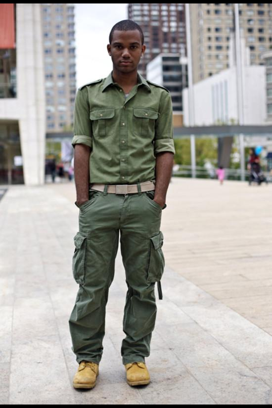
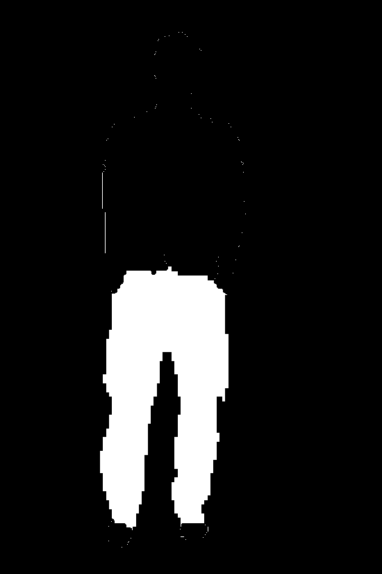
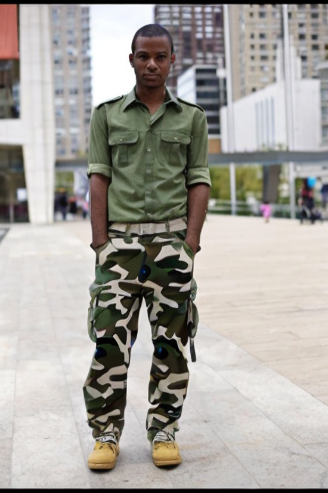

# Transformify

**Transformify** is an AI-driven image segmentation and transformation tool that leverages **SegFormer** for semantic image segmentation and **Stable Diffusion 2 Inpainting** for editing image parts based on user input. This project demonstrates how AI models can be used to enhance and transform images in creative and practical ways.

---

## **Table of Contents**

1. [Overview](#overview)
2. [Tech Stack](#tech-stack)
3. [Installation](#installation)
4. [Usage](#usage)
5. [Example](#example)
6. [Training](#training)
7. [Results](#results)
8. [Deployment](#deployment)
9. [Contributing](#contributing)
10. [License](#license)

---

## **Overview**

Transformify allows users to upload an image, segment it into predefined classes (such as Shirts, Pants, Shoes, Accessories, etc.) using a **SegFormer** model, and then apply **Stable Diffusion 2 Inpainting** to modify parts of the image based on user-provided prompts. This tool demonstrates the power of **transformer-based models** for image segmentation and **diffusion models** for creative image transformation.

### **Key Features**
- **Image Segmentation**: Segments images into 59 classes.
- **User-Driven Image Transformation**: Users can input prompts, and the image is transformed accordingly.
- **Models**: Leverages SegFormer for segmentation and Stable Diffusion for image editing.
- **High Performance**: Models are trained on **Nvidia A100 GPUs** for optimal performance.

---

## **Tech Stack**

- **SegFormer**: Used for image segmentation tasks to segment images into multiple classes.
- **Stable Diffusion 2 (Inpainting)**: Generates and transforms parts of the image based on input prompts.
- **Hugging Face**: Provides access to Stable Diffusion models for easy deployment and experimentation.
- **TensorFlow**: Used for specific model-related tasks, including fine-tuning, training, and deploying other models within the project.
- **PyTorch**: The framework used to train and fine-tune both models.
- **Python**: The programming language used for the implementation of the project.
- **PIL (Python Imaging Library)**: Used for handling image processing tasks like opening, saving, and manipulating images.
- **Nvidia A100 GPUs**: Used for training the models efficiently.

---

## **Example**

### Input Image:

### Segmented Image:

### Transformed Image:

## **Installation**
## **Usage**

1. **YET TO BE DEPLOYED**

